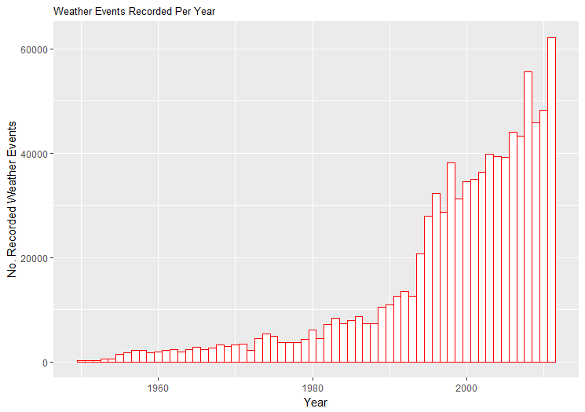
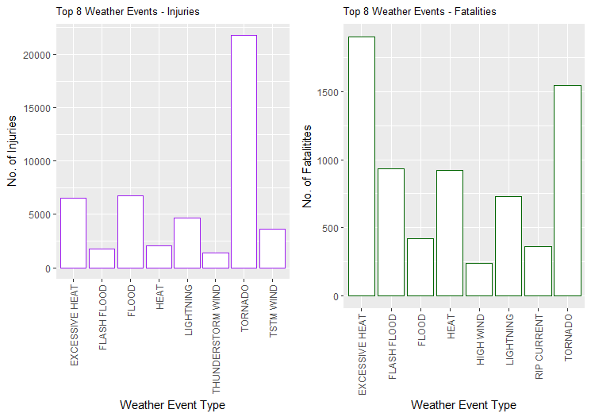
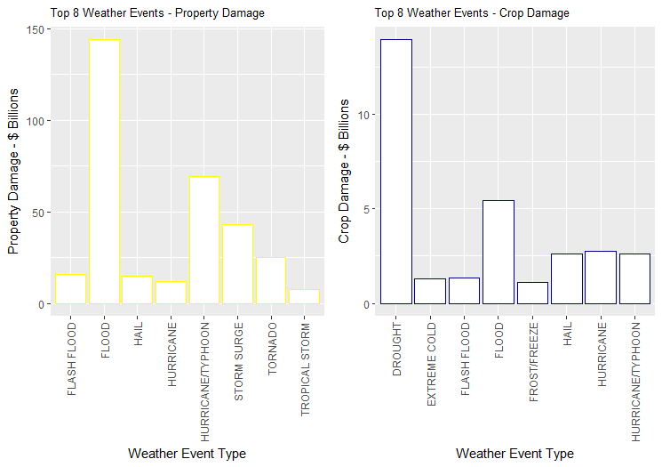

### Synopsis

In this report we aim to answer some basic questions about severe weather
events.  Specifically, we try to identify which types of events are the most
harmful to population health and the most deleterious to the economy.
To answer these questions, we obtained the storm database from the
U.S. National Oceanic and Atmospheric Administration's (NOAA).  This database
tracks characteristics of major storms and weather events in the United States,
including estimates of any fatalities, injuries, and property and crop damage.
From these data, we found that tornadoes and heat are the severe weather
event types by far most dangerous to people, while flooding, hurricanes, and storm
surges are the most costly event types to the economy.  Interestingly, only
flooding is one of the top three most dangerous or most costly event types.


### Data Processing

to install quantmod package use install.packages('quantmod')
to install gridExtra package use  install.packages("gridExtra")

```r
library(dplyr)
library(data.table)
library(ggplot2)
library(gridExtra)
```

## Getting and Loading the Data

From the Coursera "Reproducible Research" course
[file repository](https://d396qusza40orc.cloudfront.net/repdata%2Fdata%2FStormData.csv.bz2),
we obtain the storm data in bzip archive format and extract it by downloading to the working directory and rename it as repdata-data-StormData.csv

```r
stormData <- read.csv(("repdata-data-StormData.csv"), header=TRUE, stringsAsFactors = FALSE)
```

We check the first few rows in the dataset, which should have 902297 rows in total.


```r
dim(stormData)
```

```
## [1] 902297     37
```

```r
head(stormData, n = 3)
```

```
##    STATE__          BGN_DATE BGN_TIME TIME_ZONE COUNTY COUNTYNAME STATE
## 1:       1 4/18/1950 0:00:00     0130       CST     97     MOBILE    AL
## 2:       1 4/18/1950 0:00:00     0145       CST      3    BALDWIN    AL
## 3:       1 2/20/1951 0:00:00     1600       CST     57    FAYETTE    AL
##     EVTYPE BGN_RANGE BGN_AZI BGN_LOCATI END_DATE END_TIME COUNTY_END
## 1: TORNADO         0                                               0
## 2: TORNADO         0                                               0
## 3: TORNADO         0                                               0
##    COUNTYENDN END_RANGE END_AZI END_LOCATI LENGTH WIDTH F MAG FATALITIES
## 1:         NA         0                      14.0   100 3   0          0
## 2:         NA         0                       2.0   150 2   0          0
## 3:         NA         0                       0.1   123 2   0          0
##    INJURIES PROPDMG PROPDMGEXP CROPDMG CROPDMGEXP WFO STATEOFFIC ZONENAMES
## 1:       15    25.0          K       0                                    
## 2:        0     2.5          K       0                                    
## 3:        2    25.0          K       0                                    
##    LATITUDE LONGITUDE LATITUDE_E LONGITUDE_ REMARKS REFNUM
## 1:     3040      8812       3051       8806              1
## 2:     3042      8755          0          0              2
## 3:     3340      8742          0          0              3
```

### Restricting to recent years

The events in the database start in the year 1950 and end in November 2011. In the earlier years of the database there are generally fewer events recorded, most likely due to a lack of good records. More recent years should be considered more complete.

One concern is that there may be an inconsistence balance of event types
recorded over the years.  For example, maybe in the earlier years, deaths due
to rip currents were not recorded.  To allow for more fair comparisons,
we want to restrict our analysis to years that demonstrate a large number of
recorded events, as this may indicate better record-keeping.

So we count the number of events per year.

# grab year from BGN_DATE
```r
stormData$year <- as.numeric(format(as.Date(stormData$BGN_DATE, format = "%m/%d/%Y %H:%M:%S"), "%Y"))
```

# check additional column is added to dataframe
```r
dim(stormData)
```

```
## [1] 902297     38
```

The next step is to subset the dataframe into a new dataframe 'selectedData2' with the columns needed for the analysis.

# Subset the dataframe into a new dataframe 'selectedData2'
```r
setcol <- c("EVTYPE","FATALITIES", "INJURIES", "PROPDMG", "PROPDMGEXP","CROPDMG", "CROPDMGEXP", "year")
selectedData2 <- stormData[setcol]
```
Use 'head' and 'dim' to review the structure of the subset data and the first few rows of the subset dataframe 'selectedData2'.

```r
head(selectedData2)
```
```
##    EVTYPE FATALITIES INJURIES PROPDMG PROPDMGEXP CROPDMG CROPDMGEXP year
## 1 TORNADO          0       15    25.0          K       0            1950
## 2 TORNADO          0        0     2.5          K       0            1950
## 3 TORNADO          0        2    25.0          K       0            1951
## 4 TORNADO          0        2     2.5          K       0            1951
## 5 TORNADO          0        2     2.5          K       0            1951
## 6 TORNADO          0        6     2.5          K       0            1951
```

```r
dim(selectedData2)
```

```
## [1] 902297      8
```

Plot events recorded for each year.

# Plot events for each year.

```r
eventsplot <- ggplot(selectedData2, aes(year)) + geom_histogram(binwidth=1, fill="white", colour="red") + xlab("Year") + ylab("No. Recorded Weather Events") + ggtitle("Weather Events Recorded Per Year") + theme(plot.title = element_text(size = 10))

eventsplot
```



From a plot, we see that the number of events tracked starts to significantly pick up around 1995.
So we restrict the dataset to those recent events, in the hope that we get a more
consistent balance of event types across recent years.

# subset to only data from 1993 onwards

```r
selectedData3 <- selectedData2[selectedData2$year >= 1995, ]
```
# Check dataframe for reduction in rows. No. of columns should stay the same. 

```r
dim(selectedData3)
```

```
## [1] 681500     8
```

# Update exponential values to numeric equivalent

The next step is to identify the unique variables in PROPDMGEXP

```r
unique(selectedData3$PROPDMGEXP)
```

```
##  [1] ""  "B" "M" "K" "m" "+" "0" "5" "6" "?" "4" "2" "3" "7" "H" "-" "1" "8"
```

The are a number of character variables that need to be converted to the correct exponential numeric equivalent ("H" and "h" is hundred and is replaced by "2" for 2 zeros. Also, "k" for thousand/ 3 zeros; "m" for million and "B" for billion. "+","-" and "?"=" are also replaced by zero.

# Replace PROPDMGEXP to the equivalent numeric value.

```r
selectedData3$propExp <- selectedData3$PROPDMGEXP
selectedData3$propExp <- revalue(selectedData3$propExp, c("K"="3","M"="6","m"="6","B"="9","+"="0","H"="2","-"="0","?"="0"))
selectedData3$propExp[selectedData3$propExp==""] <- "0"
selectedData3$propExp <- as.numeric(selectedData3$propExp)
```

Identify the unique variables in CROPDMGEXP

```r
unique(selectedData3$CROPDMGEXP)
```

```
##  [1] ""  "M" "m" "K" "B" "?" "0" "k" "2"
```

Again, there are a number of character variables that need to be converted to the correct exponential numeric equivalent.

# Replace CROPDMGEXP to the equivalent numeric value.
```r
selectedData3$cropExp <- selectedData3$CROPDMGEXP
selectedData3$cropExp <- revalue(selectedData3$cropExp, c("K"="3","k"="3", "M"="6", "m"="6", "B"="9", "?"="0"))
selectedData3$cropExp[selectedData3$cropExp==""] <- "0"
selectedData3$cropExp <- as.numeric(selectedData3$cropExp)

selectedData3$TOTALPROPDMG <- selectedData3$PROPDMG * (10^selectedData3$propExp)

selectedData3$TOTALCROPDMG <- selectedData3$CROPDMG * (10^selectedData3$cropExp)
```

# Convert to Billions by dividing by 1000000000
```r
selectedData3$TOTALPROPDMG <- selectedData3$TOTALPROPDMG / 1000000000

selectedData3$TOTALCROPDMG <- selectedData3$TOTALCROPDMG / 1000000000
```
# Use 'head' and 'dim' to review the structure of dataframe after data processing steps.  
```r
head(selectedData3)
```
```
##                        EVTYPE FATALITIES INJURIES PROPDMG PROPDMGEXP CROPDMG CROPDMGEXP year propExp
##187560           FREEZING RAIN          0        0     0.0                  0            1995       0
##187561                    SNOW          0        0     0.0                  0            1995       0
##187563                SNOW/ICE          0        0     0.0                  0            1995       0
##187565                SNOW/ICE          0        0     0.0                  0            1995       0
##187566 HURRICANE OPAL/HIGH WINDS        2        0     0.1          B      10          M 1995       9
##187575                    HAIL          0        0     0.0                  0            1995       0
##      cropExp TOTALPROPDMG TOTALCROPDMG
##187560       0          0.0         0.00
##187561       0          0.0         0.00
##187563       0          0.0         0.00
##187565       0          0.0         0.00
##187566       6          0.1         0.01
##187575       0          0.0         0.00
```

```r
dim(selectedData3)
```

```
[1] 681500     12

```


### Results

Question 1 - Population Health
To answer question - which types of weather events are most harmful with respect to population health? Identify the top 8 weather events with the largest number of injuries; and also identify the top 8 weather events with the largest number of fatalities. Print out these results.

```r
# Aggregate 8 weather event types with the largest number of injuries
injuries <- aggregate(INJURIES ~ EVTYPE, selectedData3, sum)
injuries <- injuries[order(-injuries$INJURIES), ][1:8, ]

# Print results
print(injuries)
```

```
##                EVTYPE INJURIES
## 666           TORNADO    21765
## 144             FLOOD     6769
## 112    EXCESSIVE HEAT     6525
## 358         LIGHTNING     4631
## 683         TSTM WIND     3630
## 231              HEAT     2030
## 134       FLASH FLOOD     1734
## 607 THUNDERSTORM WIND     1426
```

```r
# Aggregate 8 weather event types with the largest number of fatalities
fatalities <- aggregate(FATALITIES ~ EVTYPE, selectedData3, sum)
fatalities <- fatalities[order(-fatalities$FATALITIES), ][1:8, ]

# Print results
print(fatalities)
```

```
##             EVTYPE FATALITIES
## 112 EXCESSIVE HEAT       1903
## 666        TORNADO       1545
## 134    FLASH FLOOD        934
## 231           HEAT        924
## 358      LIGHTNING        729
## 144          FLOOD        423
## 461    RIP CURRENT        360
## 288      HIGH WIND        241
```

Using ggplot2 to generate visuals plot of these results in a single figure:

```r
# Plot top 8 weather event types with the largest number of injuries
injuriesPlot <- ggplot(injuries, aes(x=EVTYPE, y=INJURIES)) + geom_bar(stat="identity", fill="white", colour="purple") + xlab("Weather Event Type") + ylab("No. of Injuries") + ggtitle("Top 8 Weather Events - Injuries") + theme(axis.text.x=element_text(angle=90,hjust=1,vjust=0.5)) + theme(plot.title = element_text(size = 10))

# Plot 8 weather event types with the largest number of fatalities
fatalitiesPlot <- ggplot(fatalities, aes(x=EVTYPE, y=FATALITIES)) + geom_bar(stat="identity", fill="white", colour="darkgreen") + xlab("Weather Event Type") + ylab("No. of Fatalitites") + ggtitle("Top 8 Weather Events - Fatalities") + theme(axis.text.x=element_text(angle=90,hjust=1,vjust=0.5)) + theme(plot.title = element_text(size = 10))

# Arrange both results in the same plot grid.
grid.arrange(injuriesPlot, fatalitiesPlot, ncol =2)
```




Tornado is the weather event type generating the largest number of injuries across the USA during the 1995 - 2011 time period.
Excessive Heat is the weather event type generating the largest number of fatalitites across the USA during the 1995 - 2011 time period. Tornado is a close second for largest number of fatalities.

Question 2 - greatest economic consequences.
To answer question - (2) which types of weather events have the greatest economic consequences? Identify the top 8 weather events with the greatest cost values for crop damage; and also identify the top 8 weather events with the greatest cost values for property damage. Print out these results.

```r
# Aggregate 8 weather event types with the greatest property damage
agrProperty <- aggregate(TOTALPROPDMG~EVTYPE, data = selectedData3,"sum")
property <- agrProperty[order(-agrProperty$TOTALPROPDMG), ][1:8, ]
property
```

```
##                EVTYPE TOTALPROPDMG
## 144             FLOOD   144.022037
## 313 HURRICANE/TYPHOON    69.305840
## 519       STORM SURGE    43.193536
## 666           TORNADO    24.935940
## 134       FLASH FLOOD    16.047795
## 206              HAIL    15.048722
## 306         HURRICANE    11.812819
## 677    TROPICAL STORM     7.653336
```
```r
# Aggregate 8 weather event types with the greatest crop damage
agrCrop <- aggregate(TOTALCROPDMG~EVTYPE, data = selectedData3,"sum")
crop <- agrCrop[order(-agrCrop$TOTALCROPDMG), ][1:8, ]
crop
```

```
##                EVTYPE TOTALCROPDMG
## 84            DROUGHT    13.922066
## 144             FLOOD     5.422810
## 306         HURRICANE     2.741410
## 206              HAIL     2.614127
## 313 HURRICANE/TYPHOON     2.607873
## 134       FLASH FLOOD     1.343915
## 121      EXTREME COLD     1.292473
## 179      FROST/FREEZE     1.094086
```

Using ggplot2 to generate visuals plot of these results in a single figure:

```r
# Plot top 8 weather event types with the  with the greatest property damage
propPlot <- ggplot(property, aes(x=EVTYPE, y=TOTALPROPDMG)) + geom_bar(stat="identity", fill="white", colour="yellow") + xlab("Weather Event Type") + ylab("Property Damage - $ Billions") + ggtitle("Top 8 Weather Events - Property Damage") + theme(axis.text.x=element_text(angle=90,hjust=1,vjust=0.5)) + theme(plot.title = element_text(size = 10))

# Plot top 8 weather event types with the with the greatest crop damage
cropPlot <- ggplot(crop, aes(x=EVTYPE, y=TOTALCROPDMG)) + geom_bar(stat="identity", fill="white", colour="darkblue") + xlab("Weather Event Type") + ylab("Crop Damage - $ Billions") + ggtitle("Top 8 Weather Events - Crop Damage") + theme(axis.text.x=element_text(angle=90,hjust=1,vjust=0.5)) + theme(plot.title = element_text(size = 10))

# Arrange both results in the same plot grid.
grid.arrange(propPlot, cropPlot, ncol =2)
```



Flood is the weather event type generating the greatest economic consequence for property.
Drought is the weather event type generating the greatest economic consequence for crops.
These are both across the USA during the 1993 - 2011 time period (when more substantial weather events records are available).
